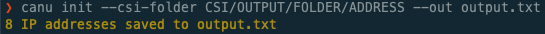

# CANU Init

## canu init

Initialize CANU by extracting all the switch IPs from CSI generated json, or by getting IPs from SLS.

To access the SLS API, a token must be passed in using the ‘–auth-token’ flag.
- Tokens are typically stored in ‘~./config/cray/tokens/’
- Instead of passing in a token file, the environmental variable SLS_TOKEN can be used.

To initialize using JSON instead of the SLS API, pass in the file containing SLS JSON data (normally sls_input_file.json) using the ‘–sls-file’ flag

If used, CSI-generated sls_input_file.json file is generally stored in one of two places depending on how far the system is in the install process.
- Early in the install process, when running off of the LiveCD the CSI sls_input_file.json file is normally found in the the directory ‘/var/www/ephemeral/prep/SYSTEMNAME/’
- Later in the install process, the CSI sls_input_file.json file is generally in ‘/mnt/pitdata/prep/SYSTEMNAME/’

The output file for the canu init command is set with the –out FILENAME flag.

```shell
canu init [OPTIONS]
```

### Options


### --sls-file( <sls_file>)
File containing system SLS JSON data.


### --auth-token( <auth_token>)
Token for SLS authentication


### --sls-address( <sls_address>)

* **Default**

    `api-gw-service-nmn.local`


### --network( <network>)
Switch network e.g. (CAN, MTL, NMN)


* **Default**

    `NMN`


### --out( <out>)
**Required** Output file with CSI IP addresses

### Environment variables


### SLS_TOKEN()
> Provide a default for `--auth-token`

## Examples

### 1. CSI

To get the switch IP addresses from CSI output, run the command:

```bash
$ canu init --sls-file SLS_FILE --out output.txt
8 IP addresses saved to output.txt
```





### 2. SLS Shasta API

To get the switch IP addresses from the Shasta SLS API, run the command:

```bash
$ canu init --auth-token ~./config/cray/tokens/ --sls-address 1.2.3.4 --out output.txt
8 IP addresses saved to output.txt
```


---

<a href="/readme.md">Back To Readme</a><br>
