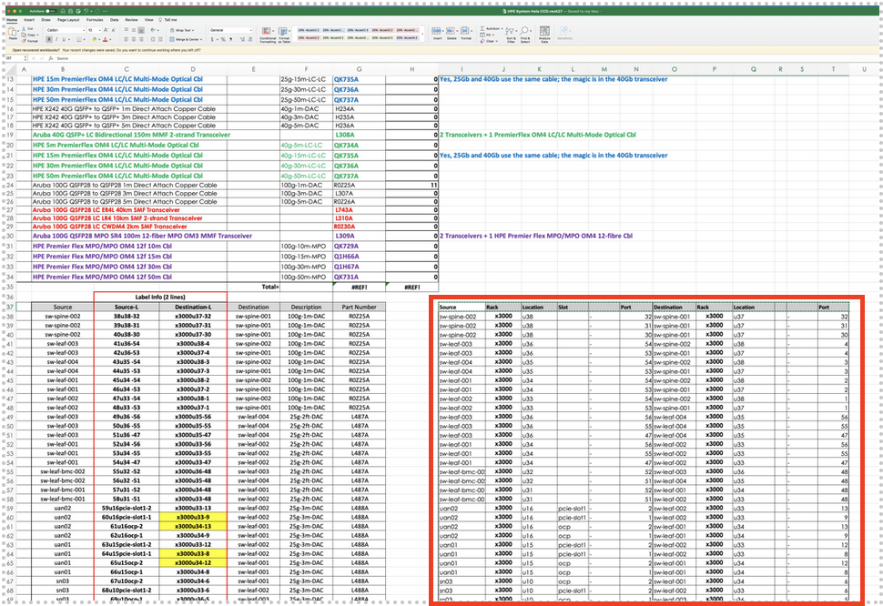

# Validate SHCD

Use CANU (CSM Automated Network Utility) to validate the SHCD. SHCD validation is required to ensure Plan-of-Record network configurations are generated. This is an iterative process to create a model of the entire network topology connection-by-connection. 

   * Open existing SHCD in Excel. 

   * Save a new copy with an incremented revision number – make sure you are editing the updated version. 

Several worksheets (tabs) are used to store the topology of the management network.  

Begin validation in the following order: 

   * 10G_25G_40G_100G tab (or some variation thereof) contains switch-to-switch connections as well as NCN server connections to the switch. 

   * NMN contains network management nodes 

   * HMN contains device BMC’s and other 1G management ports. 

	* [SHCD HMN Tab/HMN Connections Rules](https://github.com/Cray-HPE/docs-csm/blob/main/install/shcd_hmn_connections_rules.md)

   * MTN_TDS, Mountain-TDS-Management (or some variation thereof for Mountain cabinets). 

Start with the ***10G_25G_40G_100G*** tab and select the ***upper left corner*** and ***lower right corner*** of the spreadsheet with the information that looks like the line below:

***Source | Rack | Location | Slot | Port Destination | Rack | Location Port***  

This is a block of data on the right hand of the worksheet and is not the calculated values used for cable labels on the left-hand side. 



In this example above the 10G_25G_40G_100G worksheet has the upper left and lower right corners of I37 and T107 respectively. 

Use CANU to validate this worksheet. 

```text
canu validate shcd -a full --shcd ./HPE\ System\ Hela\ CCD.revA27.xlsx --tabs 10G_25G_40G_100G --corners I37,T107 
```
 
-a or –architecture can be ***tds, full or v1*** (case insensitive) for: 

* ***tds***	– Aruba-based Test and Development System. These are small systems characterized by Kubernetes NCNs cabling directly to the spine. 

* ***full***	– Aruba-based Leaf-Spine systems, usually customer production systems. 

* ***v1*** 	– Dell and Mellanox based systems of either a TDS or Full layout. 

CANU will ensure that each cell has valid data and that the connections between devices are allowed. Errors will stop processing and must be fixed in the spreadsheet before moving on. 

A “clean run” through a worksheet will include the model, a port-map of each node and may include warnings. See a list of typical errors at the end of this document to help in fixing the worksheet data. 

Once the worksheet is validated you can check for any errors: 

```text
canu validate shcd -a full --shcd ./HPE\ System\ Hela\ CCD.revA27.xlsx --tabs 10G_25G_40G_100G,NMN --corners I37,T107,J15,T16 --log DEBUG 
```

[Back to index](index.md)