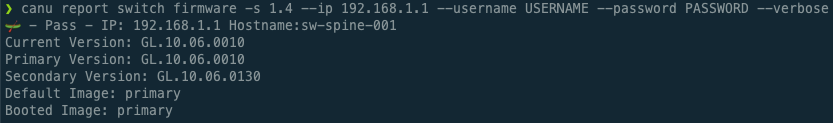
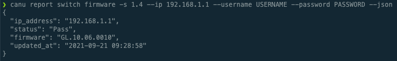
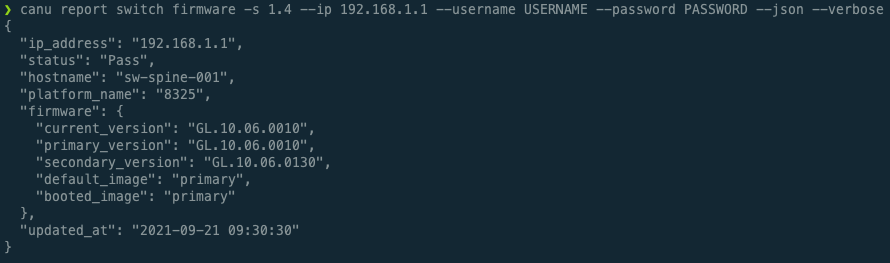

# Report Switch Firmware

Report the firmware of a switch (Aruba, Dell, or Mellanox) on the network.

The CSM version is required to determine the firmware to validate against, you can pass it in with `--csm` like `--csm 1.2`.

There are two different statuses that might be indicated.

- 🛶 - Pass: Indicates that the switch passed the firmware verification.
- ❌ - Fail: Indicates that the switch failed the firmware verification. A list of expected firmware versions will be displayed.

## Examples

### 1. Firmware

To check the firmware of a single switch run: `canu report switch firmware --csm 1.2 --ip 192.168.1.1 --username USERNAME --password PASSWORD`

```bash
$ canu report switch firmware --csm 1.2 --ip 192.168.1.1 --username USERNAME --password PASSWORD

🛶 - Pass - IP: 192.168.1.1 Hostname: test-switch-spine01 Firmware: GL.10.06.0001
```


### 2. Firmware Verbose

To get verbose firmware details of a single switch: `canu report switch firmware --csm 1.2 --ip 192.168.1.1 --username USERNAME --password PASSWORD --verbose`

```bash
$ canu report switch firmware --csm 1.2 --ip 192.168.1.1 --username USERNAME --password PASSWORD --verbose

🛶 - Pass - IP: 192.168.1.1 Hostname: test-switch-spine01
Current Version: GL.10.06.0010
Primary Version: GL.10.06.0010
Secondary Version: GL.10.05.0020
Default Image: primary
Booted Image: primary
```



### 3. Firmware JSON

To get firmware details of a single switch with JSON output: `canu report switch firmware --csm 1.2 --ip 192.168.1.1 --username USERNAME --password PASSWORD --json`

```bash
$ canu report switch firmware - 1.4 --ip 192.168.1.1 --username USERNAME --password PASSWORD --json
{
  "ip_address": "192.168.1.1",
  "status": "Pass",
  "firmware": "GL.10.06.0010",
  "updated_at": "2021-01-01 08:00:00"
}
```



### 4. Firmware JSON Verbose

To get firmware details of a single switch with JSON output: `canu report switch firmware --csm 1.2 --ip 192.168.1.1 --username USERNAME --password PASSWORD --json --verbose`

```bash
$ canu report switch firmware --csm 1.2 --ip 192.168.1.1 --username USERNAME --password PASSWORD --json --verbose
{
  "ip_address": "192.168.1.1",
  "status": "Pass",
  "hostname": "test-switch-spine01",
  "platform_name": "8325",
  "firmware": {
    "current_version": "GL.10.06.0010",
    "primary_version": "GL.10.06.0010",
    "secondary_version": "GL.10.05.0020",
    "default_image": "primary",
    "booted_image": "primary"
  },
  "updated_at": "2021-01-01 08:00:00"
}
```



### File Out

Any combination of commands can also be run with the `--out FILENAME` flag to output the results to a file.

## Flags

| Option       | Description                    |
| ------------ | ------------------------------ |
| `--csm`      | CSM version                    |
| `--ip`       | Switch IPv4 address            |
| `--username` | Switch username                |
| `--password` | Switch password                |
| `--json`     | Bool indicating json output    |
| `--verbose`  | Bool indicating verbose output |
| `--out`      | Name of the output file        |

---

**[Back To Readme](/readme.md)**<br>
