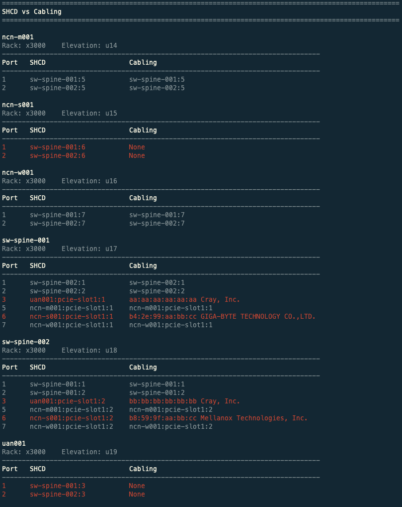

# Validate SHCD and Cabling

CANU can be used to validate an SHCD against the current network cabling.

- The `--csm` flag is used to set the CSM version of the system.
- The `--architecture / -a` flag is used to set the architecture of the system, either **TDS**, **Full**, or **V1**.
- Use the `--tabs` flag to select which tabs on the spreadsheet will be included.
- The `--corners` flag is used to input the upper left and lower right corners of the table on each tab of the worksheet. The table should contain the 11 headers: **Source, Rack, Location, Slot, (Blank), Port, Destination, Rack, Location, (Blank), Port**. If the corners are not specified, you will be prompted to enter them for each tab.
- To enter a comma separated list of IP addresses to the `---ips` flag. To read the IP addresses from a file, make sure the file has one IP address per line, and use the flag like `--ips-file FILENAME` to input the file.

## Example

### Validate SHCD and Cabling

To validate an SHCD against the cabling run: `canu validate shcd-cabling --csm 1.2 -a tds --shcd FILENAME.xlsx --tabs 25G_10G,NMN --corners I14,S49,I16,S22 --ips 192.168.1.1,192.168.1.2 --username USERNAME --password PASSWORD`

```bash
$ canu validate shcd-cabling --csm 1.2 -a tds --shcd FILENAME.xlsx --tabs 25G_10G,NMN --corners I14,S49,I16,S22 --ips 192.168.1.1,192.168.1.2 --username USERNAME --password PASSWORD

====================================================================================================
SHCD vs Cabling
====================================================================================================

sw-spine-001
Rack: x3000    Elevation: u12
--------------------------------------------------------------------------------
Port   SHCD                     Cabling
--------------------------------------------------------------------------------
1      sw-spine-002:1           sw-spine-002:1
2      sw-spine-002:2           sw-spine-002:2
3      uan001:pcie-slot1:1      aa:aa:aa:aa:aa:aa Cray, Inc.
5      ncn-m001:pcie-slot1:1    ncn-m001:pcie-slot1:1
6      ncn-s002:pcie-slot1:1    ncn-s002:pcie-slot1:1
7      ncn-w001:pcie-slot1:1    ncn-w001:pcie-slot1:1

sw-spine-002
Rack: x3000    Elevation: u13
--------------------------------------------------------------------------------
Port   SHCD                     Cabling
--------------------------------------------------------------------------------
1      sw-spine-001:1           sw-spine-001:1
2      sw-spine-001:2           sw-spine-001:2
3      uan001:pcie-slot1:2      bb:bb:bb:bb:bb:bb Cray, Inc.
5      ncn-m001:pcie-slot1:2    ncn-m001:pcie-slot1:2
6      ncn-s002:pcie-slot1:2    ncn-s002:pcie-slot1:2
7      ncn-w001:pcie-slot1:2    ncn-w001:pcie-slot1:2

ncn-m001
Rack: x3000    Elevation: u14
--------------------------------------------------------------------------------
Port   SHCD                     Cabling
--------------------------------------------------------------------------------
1      sw-spine-001:5           sw-spine-001:5
2      sw-spine-002:5           sw-spine-002:5

ncn-s001
Rack: x3000    Elevation: u15
--------------------------------------------------------------------------------
Port   SHCD                     Cabling
--------------------------------------------------------------------------------
1      sw-spine-001:6           sw-spine-001:6
2      sw-spine-002:6           sw-spine-002:6

ncn-w001
Rack: x3000    Elevation: u16
--------------------------------------------------------------------------------
Port   SHCD                     Cabling
--------------------------------------------------------------------------------
1      sw-spine-001:7           sw-spine-001:7
2      sw-spine-002:7           sw-spine-002:7


====================================================================================================
SHCD Warnings
====================================================================================================

Warnings

Node type could not be determined for the following
------------------------------------------------------------
Sheet: HMN
Cell: R21      Name: SITE


====================================================================================================
Cabling Warnings
====================================================================================================

Node type could not be determined for the following
------------------------------------------------------------
sw-spine-001     1/1/3     ===> aa:aa:aa:aa:aa:aa Cray, Inc.
sw-spine-002     1/1/3     ===> bb:bb:bb:bb:bb:bb Cray, Inc.
Nodes that show up as MAC addresses might need to have LLDP enabled.
```



The output of the `validate shcd-cabling` command will show a port by port comparison between the devices found in the SHCD and devices found on the network. If there is a difference in what is found connected to a devices port in SHCD and Cabling, the line will be highlighted in red.

### File Out

To output the results of the `validate shcd-cabling` command to a file, append the `--out FILENAME` flag

## Flags

| Option                | Description                                                                |
| --------------------- | -------------------------------------------------------------------------- |
| `--csm`               | CSM version                                                                |
| `-a / --architecture` | CSM architecture ("Full", or "TDS")                                        |
| `--shcd`              | SHCD File                                                                  |
| `--tabs`              | The tabs on the SHCD file to check, e.g. 10G_25G_40G_100G,NMN,HMN.         |
| `--corners`           | The corners on each tab, comma separated e.g. 'J37,U227,J15,T47,J20,U167'. |
| `--ips`               | Comma separated list of IPv4 addresses of switches                         |
| `--ips-file`          | File with one IPv4 address per line                                        |
| `--username`          | Switch username                                                            |
| `--password`          | Switch password                                                            |
| `--log`               | Level of logging. ("DEBUG", "INFO", "WARNING", "ERROR")                    |
| `--json`              | Bool indicating json output                                                |
| `--out`               | Name of the output file                                                    |

---

**[Back To Readme](/readme.md)**<br>
