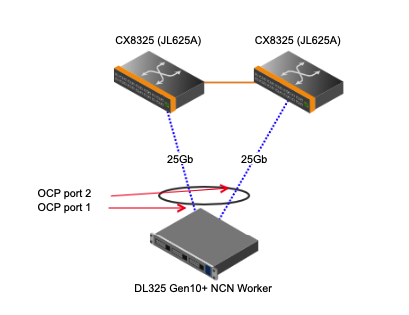
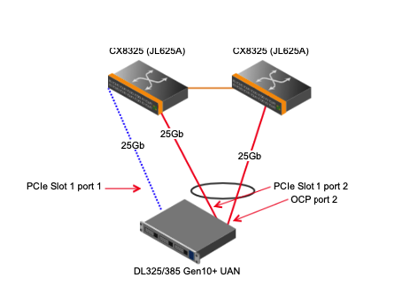

# HPE Cabling Standards and Descriptions- CSM v1.2

Hardware Type: HPE

Software Version: CSM v1.2

## NCN - MASTER

| Device | Port | Linux Device | Destination | Name | VLAN | LAG |
|:-------|------|:------|:-------------------------|:--------------|:--------------------|:-----|
| OCP | 1 |  mgmt0 | primary |  N/A |  HMN, NMN, CAN  |  MLAG-LACP |
| OCP | 2 |  mgmt1 | site |  N/A |  N/A  |  N/A |
| PCIE-SLOT1 | 1 |  mgmt2 | secondary |  N/A |  HMN, NMN, CAN  |  MLAG-LACP |
| PCIE-SLOT1 | 2 |  mgmt3 | None |  N/A |  N/A  |  N/A |
| ILO | 1 |  None | HMN Leaf |  N/A |  HMN  |  N/A |

 
NOTES:

* REQUIRED:  Master 001 (ncn-m001) is required to have a site connection on OCP Port 2 for installation and maintenance.
* RECOMMENDED: Masters 002 and 003 may optionally have a site connection on OCP Port 2 for emergency system access.
* REQUIRED:  Master 001 (ncn-m001) is required to have it's BMC/iLO connected to the site.
 
 

## NCN - WORKER

| Device | Port | Linux Device | Destination | Name | VLAN | LAG |
|:-------|------|:------|:-------------------------|:--------------|:--------------------|:-----|
| OCP | 1 |  mgmt0 | primary |  N/A |  HMN, NMN, CAN  |  MLAG-LACP |
| OCP | 2 |  mgmt1 | secondary |  N/A |  HMN, NMN, CAN  |  MLAG-LACP |
| ILO | 1 |  None | HMN Leaf |  N/A |  HMN  |  N/A |

 
NOTES:

* A single OCP card is the default worker configuration.
 
 

## NCN - STORAGE

| Device | Port | Linux Device | Destination | Name | VLAN | LAG |
|:-------|------|:------|:-------------------------|:--------------|:--------------------|:-----|
| OCP | 1 |  mgmt0 | primary |  N/A |  HMN, NMN, CAN  |  MLAG-LACP |
| OCP | 2 |  mgmt1 | primary |  N/A |  SUN  |  MLAG-LACP |
| PCIE-SLOT1 | 1 |  mgmt2 | secondary |  N/A |  HMN, NMN, CAN  |  MLAG-LACP |
| PCIE-SLOT1 | 2 |  mgmt3 | secondary |  N/A |  SUN  |  MLAG-LACP |
| ILO | 1 |  None | HMN Leaf |  N/A |  HMN  |  N/A |

 
NOTES:

* All ports are cabled.
* OCP Port 1 and PCIE Slot 1 Port 1 (first ports) are bonded for the NMN, HMN and CAN.
* OCP Port 2 and PCIE Slot 1 Port 2 (second ports) cabled but not configured in this release.
 
 

## APPLICATION - UAN

| Device | Port | Linux Device | Destination | Name | VLAN | LAG |
|:-------|------|:------|:-------------------------|:--------------|:--------------------|:-----|
| OCP | 1 |  mgmt0 | primary |  N/A |  NMN  |  N/A |
| OCP | 2 |  mgmt1 | primary |  N/A |  CAN  |  MLAG-LACP |
| PCIE-SLOT1 | 1 |  mgmt2 | secondary |  N/A |  N/A  |  N/A |
| PCIE-SLOT1 | 2 |  mgmt3 | secondary |  N/A |  CAN  |  MLAG-LACP |
| ILO | 1 |  None | HMN Leaf |  N/A |  HMN  |  N/A |

 
NOTES:

* All ports are cabled.
* The OCP Port 1 connects to the NMN in a non-bonded configuration.
* The PCIE Slot 1 Port 1 is cabled but not configured/used in this release.
* OCP Port 2 and PCIE Slot 1 Port 2 (second ports) are bonded for the CAN.
 
 

## APPLICATION - LOGIN

| Device | Port | Linux Device | Destination | Name | VLAN | LAG |
|:-------|------|:------|:-------------------------|:--------------|:--------------------|:-----|
| OCP | 1 |  mgmt0 | primary |  N/A |  HMN, NMN, CAN  |  MLAG-LACP |
| OCP | 2 |  mgmt1 | secondary |  N/A |  HMN, NMN, CAN  |  MLAG-LACP |
| ILO | 1 |  None | HMN Leaf |  N/A |  HMN  |  N/A |

 
 

## MOUNTAIN - CMM

| Device | Port | Linux Device | Destination | Name | VLAN | LAG |
|:-------|------|:------|:-------------------------|:--------------|:--------------------|:-----|
| CMM | 1 |  None | primary |  N/A |  HMN_MTN, NMN_MTN  |  MLAG-STATIC |
| CMM | 2 |  None | secondary |  N/A |  HMN_MTN, NMN_MTN  |  MLAG-STATIC |

 
 

## MOUNTAIN - CEC

| Device | Port | Linux Device | Destination | Name | VLAN | LAG |
|:-------|------|:------|:-------------------------|:--------------|:--------------------|:-----|
| CEC | 1 |  None | CDU switch access port |  N/A |  HMN_MTN  |  N/A |

 
 
