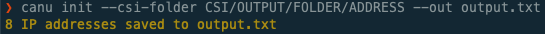
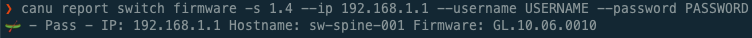
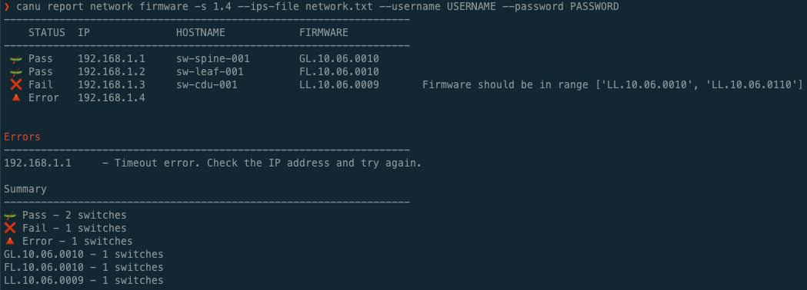
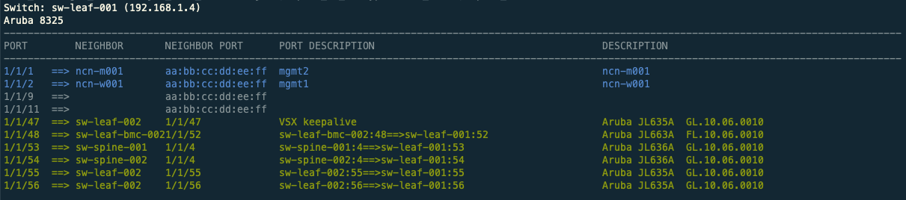
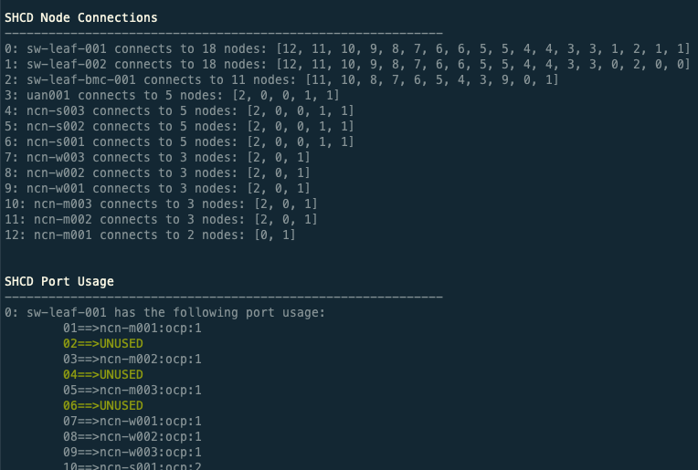
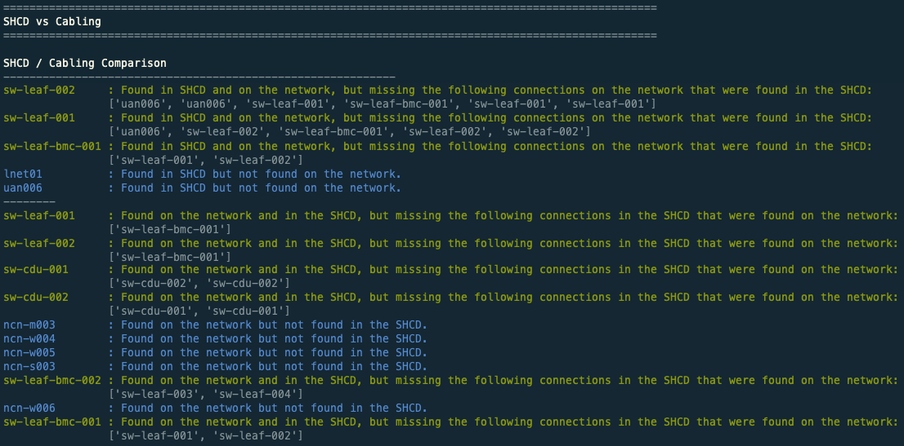
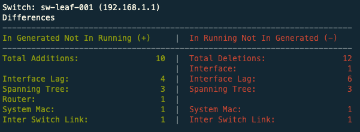

# 🛶 CANU v0.0.6

CANU (CSM Automatic Network Utility) will float through a Shasta network and make switch setup and validation a breeze.

CANU can be used to:

- Check if switches (Aruba, Dell, or Mellanox) on a Shasta network meet the firmware version requirements
- Check network cabling status using LLDP
- Validate BGP status
- Configure BGP
- Validate that SHCD spreadsheets are configured correctly and pass a number of checks
- Validate an SHCD against actual network cabling status to check for mis-cabling
- Generate switch configuration for an entire network

# Quickstart Guide

To checkout a fresh system using CSI:

1. Make a new directory to save switch IP addresses: `mkdir ips_folder`, `cd ips_folder`
2. Parse CSI files and save switch IP addresses: `canu init --sls-file sls_input_file.json --out ips.txt`
3. Check network firmware: `canu report network firmware --csm 1.2 --ips-file ips.txt`
4. Check network cabling: `canu report network cabling --ips-file ips.txt`
5. Validate BGP status: `canu validate network bgp --ips-file ips.txt --verbose`
6. Validate cabling: `canu validate network cabling --ips-file ips.txt`

If you have the system's SHCD, there are even more commands that can be run

7. Validate the SHCD: `canu validate shcd --shcd SHCD.xlsx`
8. Validate the SHCD against network cabling: `canu validate shcd-cabling --shcd SHCD.xlsx --ips-file ips.txt`
9. Generate switch config for the network: `canu generate network config --shcd SHCD.xlsx --sls-file sls_input_file.json --folder configs`

# Table of Contents

**[Installation](#installation)**<br>
**[CANU Initialization](#initialization)**<br>
**[Report Switch Firmware](#report-switch-firmware)**<br>
**[Report Network Firmware](#report-network-firmware)**<br>
**[Report Switch Cabling](#report-switch-cabling)**<br>
**[Report Network Cabling](#report-network-cabling)**<br>
**[Validate SHCD](#validate-shcd)**<br>
**[Validate Network Cabling](#validate-network-cabling)**<br>
**[Validate SHCD and Cabling](#validate-shcd-and-cabling)**<br>
**[Validate Network BGP](#validate-network-bgp)**<br>
**[Config BGP](#config-bgp)**<br>
**[Generate Switch Config](#generate-switch-config)**<br>
**[Generate Network Config](#generate-network-config)**<br>
**[Validate Switch Config](#validate-switch-config)**<br>
**[Validate Network Config](#validate-network-config)**<br>
**[Cache](#cache)**<br>
**[Uninstallation](#uninstallation)**<br>
**[Road Map](#road-map)**<br>
**[Testing](#testing)**<br>
**[Changelog](#changelog)**<br>

# Installation and Usage

## Prerequisites

In order to run CANU, both python3 and pip3 need to be installed.

## Installation

- To run CANU inside a container:

  - Prerequisites:
    - docker
    - docker-compose

  ```bash
    sh canu_docker.sh up
  ```

  - CANU source files can be found inside the container at /app/canu
  - shared folder between local disk is call `files` and is mounted in the container at `/files`
  - When you are finished with the container and `exit` the container:

  ```bash
    sh canu_docker.sh down
  ```

- To run CANU in a Python Virtualenv:

  - Prerequisites
    - python3
    - pip3
    - Python Virtualenv

  ```bash
    python3 -m venv .venv
    source ./.venv/bin/activate
    pip3 install ./canu
  ```

  - When you are done working in the Python Virtualenv.
    Use the following command to exit out of the Python Virtualenv:

  ```bash
  deactivate
  ```

- To install the development build of CANU type:

  ```bash
  python3 setup.py develop --user
  ```

  If that doesn't work, try:

  ```bash
  pip3 install --editable .
  ```

## Usage

To run, just type `canu`, it should run and display help. To see a list of commands and arguments, just append `--help`.

### Initialization

**[Details](docs/init.md)**<br>

To help make switch setup a breeze. CANU can automatically parse SLS JSON data - including CSI sls_input_file.json output or the Shasta SLS API for switch IPv4 addresses.

#### CSI Input

- In order to parse CSI output, use the `--sls-file FILE` flag to pass in the folder where an SLS JSON file is located.

The CSI _sls_input_file.json_ file is generally stored in one of two places depending on how far the system is in the install process.

- Early in the install process, when running off of the LiveCD the CSI _sls_input_file.json_ file is normally found in the the directory `/var/www/ephemeral/prep/SYSTEMNAME/`
- Later in the install process, the CSI _sls_input_file.json_ file is generally in `/mnt/pitdata/prep/SYSTEMNAME/`
- The switch IPs will be read from the 'NMN' network, if a different network is desired, use the `--network` flag to choose a different one e.g. (CAN, MTL, NMN).

To get the switch IP addresses from CSI output, run the command:

```bash
$ canu init --sls-file SLS_FILE --out output.txt
8 IP addresses saved to output.txt
```

#### SLS API Input

- To parse the Shasta SLS API for IP addresses, ensure that you have a valid token. The token file can either be passed in with the `--auth-token TOKEN_FILE` flag, or it can be automatically read if the environmental variable **SLS_TOKEN** is set. The SLS address is default set to _api-gw-service-nmn.local_, if you are operating on a system with a different address, you can set it with the `--sls-address SLS_ADDRESS` flag.

To get the switch IP addresses from the Shasta SLS API, run the command:

```bash
$ canu init --auth-token ~./config/cray/tokens/ --sls-address 1.2.3.4 --out output.txt
8 IP addresses saved to output.txt
```



The output file for the `canu init` command is set with the `--out FILENAME` flag.

### Report Switch Firmware

**[Details](docs/report_switch_firmware.md)**<br>

CANU checks the switch firmware version against the standard in the _canu.yaml_ file found in the root directory.

The CSM version is required to determine the firmware to validate against, you can pass it in with `--csm` like `--csm 1.2`.

To check the firmware of a single switch run: `canu report switch firmware --csm 1.2 --ip 192.168.1.1 --username USERNAME --password PASSWORD`

```bash
$ canu report switch firmware --csm 1.2 --ip 192.168.1.1 --username USERNAME --password PASSWORD
🛶 - Pass - IP: 192.168.1.1 Hostname:sw-spine-001 Firmware: GL.10.06.0010
```



### Report Network Firmware

**[Details](docs/report_network_firmware.md)**<br>

Multiple switches on a network (Aruba, Dell, or Mellanox) can be checked for their firmware versions. The IPv4 addresses of the switches can either be entered comma separated, or be read from a file. To enter a comma separated list of IP addresses to the `---ips` flag. To read the IP addresses from a file, make sure the file has one IP address per line, and use the flag like `--ips-file FILENAME` to input the file.

The CSM version is required to determine the firmware to validate against, you can pass it in with `--csm` like `--csm 1.2`.

An example of checking the firmware of multiple switches: `canu report network firmware --csm 1.2 --ips 192.168.1.1,192.168.1.2 --username USERNAME --password PASSWORD`

```bash
$ canu report network firmware --csm 1.2 --ips 192.168.1.1,192.168.1.2,192.168.1.3,192.168.1.4 --username USERNAME --password PASSWORD

------------------------------------------------------------------
    STATUS  IP              HOSTNAME            FIRMWARE
------------------------------------------------------------------
 🛶 Pass    192.168.1.1     test-switch-spine01 GL.10.06.0010
 🛶 Pass    192.168.1.2     test-switch-leaf01  FL.10.06.0010
 ❌ Fail    192.168.1.3     test-wrong-version  FL.10.05.0001   Firmware should be in range ['FL.10.06.0001']
 🔺 Error   192.168.1.4


Errors
------------------------------------------------------------------
192.168.1.4     - HTTP Error. Check that this IP is an Aruba switch, or check the username and password

Summary
------------------------------------------------------------------
🛶 Pass - 2 switches
❌ Fail - 1 switches
🔺 Error - 1 switches
GL.10.06.0010 - 1 switches
FL.10.06.0010 - 1 switches
FL.10.05.0010 - 1 switches
```



When using the _network firmware_ commands, the table will show either: 🛶 Pass, ❌ Fail, or 🔺 Error. The switch will **pass** or **fail** based on if the switch firmware matches the _canu.yaml_

### Output to a File

To output the results of the switch firmware or network firmware commands to a file, append the `--out FILENAME` flag

### JSON

To get the JSON output from a single switch, or from multiple switches, make sure to use the `--json` flag. An example json output is below.

```bash
$ canu network firmware --csm 1.2 --ips 192.168.1.1,192.168.1.2 --username USERNAME --password PASSWORD --json

{
    "192.168.1.1": {
        "status": "Pass",
        "hostname": "test-switch-spine01",
        "platform_name": "8325",
        "firmware": {
            "current_version": "GL.10.06.0010",
            "primary_version": "GL.10.06.0010",
            "secondary_version": "GL.10.05.0020",
            "default_image": "primary",
            "booted_image": "primary",
        },
    },
    "192.168.1.2": {
        "status": "Pass",
        "hostname": "test-switch-leaf01",
        "platform_name": "6300",
        "firmware": {
            "current_version": "FL.10.06.0010",
            "primary_version": "FL.10.06.0010",
            "secondary_version": "FL.10.05.0020",
            "default_image": "primary",
            "booted_image": "primary",
        },
    },
}


```

### Report Switch Cabling

**[Details](docs/report_switch_cabling.md)**<br>
CANU can also use LLDP to check the cabling status of a switch. To check the cabling of a single switch run: `canu report switch cabling --ip 192.168.1.1 --username USERNAME --password PASSWORD`

```bash
$ canu report switch cabling --ip 192.168.1.1 --username USERNAME --password PASSWORD

Switch: test-switch-spine01 (192.168.1.1)
Aruba 8325
------------------------------------------------------------------------------------------------------------------------------------------
PORT        NEIGHBOR       NEIGHBOR PORT      PORT DESCRIPTION                                      DESCRIPTION
------------------------------------------------------------------------------------------------------------------------------------------
1/1/1   ==>                00:00:00:00:00:01  No LLDP data, check ARP vlan info.                    192.168.1.20:vlan1, 192.168.2.12:vlan2
1/1/3   ==> ncn-test2      00:00:00:00:00:02  mgmt0                                                 Linux ncn-test2
1/1/5   ==> ncn-test3      00:00:00:00:00:03  mgmt0                                                 Linux ncn-test3
1/1/7   ==>                00:00:00:00:00:04  No LLDP data, check ARP vlan info.                    192.168.1.10:vlan1, 192.168.2.9:vlan2
1/1/51  ==> test-spine02   1/1/51                                                                   Aruba JL635A  GL.10.06.0010
1/1/52  ==> test-spine02   1/1/52                                                                   Aruba JL635A  GL.10.06.0010
```



Sometimes when checking cabling using LLDP, the neighbor does not return any information except a MAC address. When that is the case, CANU looks up the MAC in the ARP table and displays the IP addresses and vlan information associated with the MAC.

Entries in the table will be colored based on what they are. Neighbors that have _ncn_ in their name will be colored blue. Neighbors that have a port labeled (not a MAC address), are generally switches and are labeled green. Ports that are duplicated, will be bright white.

### Report Network Cabling

**[Details](docs/report_network_cabling.md)**<br>

The cabling of multiple switches (Aruba, Dell, or Mellanox) on a network can be checked at the same time using LLDP. The IPv4 addresses of the switches can either be entered comma separated, or be read from a file. To enter a comma separated list of IP addresses to the `---ips` flag. To read the IP addresses from a file, make sure the file has one IP address per line, and use the flag like `--ips-file FILENAME` to input the file.

An example of checking the cabling of multiple switches: `canu report network cabling --ips 192.168.1.1,192.168.1.2 --username USERNAME --password PASSWORD`

There are two different `--view` options, **switch** and **equipment**.

1. The `--view switch` option displays a table for every switch IP address passed in showing connections. This is the same view as shown in the above example of checking single switch cabling.

2. The `--view equipment` option displays a table for each mac address connection. This means that servers and switches will both display incoming and outgoing connections.

An example of checking the cabling of multiple switches and displaying with the equipment view: `canu network cabling --ips 192.168.1.1,192.168.1.2 --username USERNAME --password PASSWORD --view equipment`

```bash
$ canu report network cabling --ips 192.168.1.1,192.168.1.2 --username USERNAME --password PASSWORD --view equipment

sw-spine01 Aruba JL635A  GL.10.06.0010
aa:aa:aa:aa:aa:aa
----------------------------------------------------------------------------------------------------
1/1/1                     <==> sw-spine02      1/1/1  Aruba JL635A  GL.10.06.0010
1/1/3                     ===>                 00:00:00:00:00:00 mgmt1
1/1/4                     ===> ncn-test        bb:bb:bb:bb:bb:bb mgmt1 Linux ncn-test


sw-spine02 Aruba JL635A  GL.10.06.0010
bb:bb:bb:bb:bb:bb
----------------------------------------------------------------------------------------------------
1/1/1                     <==> sw-spine01      1/1/1  Aruba JL635A  GL.10.06.0010


00:00:00:00:00:00
192.168.2.2:vlan3, 192.168.1.2:vlan1
----------------------------------------------------------------------------------------------------
00:00:00:00:00:00 mgmt1   <=== sw-spine01      1/1/3


ncn-test Linux ncn-test2
bb:bb:bb:bb:bb:bb
----------------------------------------------------------------------------------------------------
bb:bb:bb:bb:bb:bb mgmt1   <=== sw-spine01      1/1/4
```

### Validate SHCD

**[Details](docs/validate_shcd.md)**<br>

CANU can be used to validate that an SHCD (SHasta Cabling Diagram) passes basic validation checks.

- The `--architecture / -a` flag is used to set the architecture of the system, either **TDS**, **Full**, or **V1**..
- Use the `--tabs` flag to select which tabs on the spreadsheet will be included.
- The `--corners` flag is used to input the upper left and lower right corners of the table on each tab of the worksheet. The table should contain the 11 headers: **Source, Rack, Location, Slot, (Blank), Port, Destination, Rack, Location, (Blank), Port**. If the corners are not specified, you will be prompted to enter them for each tab.

To check an SHCD run: `canu validate shcd -a tds --shcd FILENAME.xlsx --tabs 25G_10G,NMN,HMN --corners I14,S25,I16,S22,J20,T39`

```bash
$ canu validate shcd -a tds --shcd FILENAME.xlsx --tabs 25G_10G,NMN,HMN --corners I14,S25,I16,S22,J20,T39

SHCD Node Connections
------------------------------------------------------------
0: sw-spine-001 connects to 6 nodes: [1, 2, 3, 4, 5, 6]
1: sw-spine-002 connects to 6 nodes: [0, 2, 3, 4, 5, 6]
2: sw-leaf-bmc-001 connects to 2 nodes: [0, 1]
3: uan001 connects to 2 nodes: [0, 1]
4: ncn-s001 connects to 2 nodes: [0, 1]
5: ncn-w001 connects to 2 nodes: [0, 1]
6: ncn-m001 connects to 2 nodes: [0, 1]

Warnings

Node type could not be determined for the following
------------------------------------------------------------
CAN switch
```



### Validate Network Cabling

**[Details](docs/validate_network_cabling.md)**<br>

CANU can be used to validate that network cabling passes basic validation checks.

- The `--architecture / -a` flag is used to set the architecture of the system, either **TDS**, **Full**, or **V1**.
- To enter a comma separated list of IP addresses to the `---ips` flag. To read the IP addresses from a file, make sure the file has one IP address per line, and use the flag like `--ips-file FILENAME` to input the file.

To validate the cabling run: `canu validate network cabling -a tds --ips 192.168.1.1,192.168.1.2 --username USERNAME --password PASSWORD`

```bash
$ canu validate network cabling -a tds --ips 192.168.1.1,192.168.1.2 --username USERNAME --password PASSWORD

Cabling Node Connections
------------------------------------------------------------
0: sw-spine-001 connects to 10 nodes: [1, 2, 3, 4]
1: ncn-m001 connects to 2 nodes: [0, 4]
2: ncn-w001 connects to 2 nodes: [0, 4]
3: ncn-s001 connects to 2 nodes: [0, 4]
4: sw-spine-002 connects to 10 nodes: [0, 1, 2, 3 ]

Warnings

Node type could not be determined for the following
------------------------------------------------------------
sw-leaf-001
sw-spine-001     1/1/1     ===> aa:aa:aa:aa:aa:aa
sw-spine-001     1/1/2     ===> 1/1/1 CFCANB4S1 Aruba JL479A  TL.10.03.0081
sw-spine-001     1/1/3     ===> 1/1/3 sw-leaf-001 Aruba JL663A  FL.10.06.0010
sw-spine-002     1/1/4     ===> bb:bb:bb:bb:bb:bb
sw-spine-002     1/1/5     ===> 1/1/2 CFCANB4S1 Aruba JL479A  TL.10.03.0081
sw-spine-002     1/1/6     ===> 1/1/6 sw-leaf-001 Aruba JL663A  FL.10.06.0010
Nodes that show up as MAC addresses might need to have LLDP enabled.

The following nodes should be renamed
------------------------------------------------------------
sw-leaf01 should be renamed (could not identify node)
sw-spine01 should be renamed sw-spine-001
sw-spine02 should be renamed sw-spine-002
```

If there are any nodes that cannot be determined or should be renamed, there will be warning tables that show the details.

### Validate SHCD and Cabling

**[Details](docs/validate_shcd_cabling.md)**<br>

CANU can be used to validate an SHCD against the current network cabling.

- The `--csm` flag is used to set the CSM version of the system.
- The `--architecture / -a` flag is used to set the architecture of the system, either **TDS**, **Full**, or **V1**.
- Use the `--tabs` flag to select which tabs on the spreadsheet will be included.
- The `--corners` flag is used to input the upper left and lower right corners of the table on each tab of the worksheet. The table should contain the 11 headers: **Source, Rack, Location, Slot, (Blank), Port, Destination, Rack, Location, (Blank), Port**. If the corners are not specified, you will be prompted to enter them for each tab.
- To enter a comma separated list of IP addresses to the `---ips` flag. To read the IP addresses from a file, make sure the file has one IP address per line, and use the flag like `--ips-file FILENAME` to input the file.

To validate an SHCD against the cabling run: `canu validate shcd-cabling --csm 1.2 -a tds --shcd FILENAME.xlsx --tabs 25G_10G,NMN --corners I14,S49,I16,S22 --ips 192.168.1.1,192.168.1.2 --username USERNAME --password PASSWORD`

```bash
$ canu validate shcd-cabling --csm 1.2 -a tds --shcd FILENAME.xlsx --tabs 25G_10G,NMN --corners I14,S49,I16,S22 --ips 192.168.1.1,192.168.1.2 --username USERNAME --password PASSWORD

====================================================================================================
SHCD vs Cabling
====================================================================================================

ncn-m001
Rack: x3000    Elevation: u14
--------------------------------------------------------------------------------
Port   SHCD                     Cabling
--------------------------------------------------------------------------------
1      sw-spine-001:5           sw-spine-001:5
2      sw-spine-002:5           sw-spine-002:5

ncn-s001
Rack: x3000    Elevation: u15
--------------------------------------------------------------------------------
Port   SHCD                     Cabling
--------------------------------------------------------------------------------
1      sw-spine-001:6           None
2      sw-spine-002:6           None

ncn-w001
Rack: x3000    Elevation: u16
--------------------------------------------------------------------------------
Port   SHCD                     Cabling
--------------------------------------------------------------------------------
1      sw-spine-001:7           sw-spine-001:7
2      sw-spine-002:7           sw-spine-002:7

sw-spine-001
Rack: x3000    Elevation: u17
--------------------------------------------------------------------------------
Port   SHCD                     Cabling
--------------------------------------------------------------------------------
1      sw-spine-002:1           sw-spine-002:1
2      sw-spine-002:2           sw-spine-002:2
3      uan001:pcie-slot1:1      aa:aa:aa:aa:aa:aa Cray, Inc.
5      ncn-m001:pcie-slot1:1    ncn-m001:pcie-slot1:1
6      ncn-s001:pcie-slot1:1    b4:2e:99:aa:bb:cc GIGA-BYTE TECHNOLOGY CO.,LTD.
7      ncn-w001:pcie-slot1:1    ncn-w001:pcie-slot1:1

sw-spine-002
Rack: x3000    Elevation: u18
--------------------------------------------------------------------------------
Port   SHCD                     Cabling
--------------------------------------------------------------------------------
1      sw-spine-001:1           sw-spine-001:1
2      sw-spine-001:2           sw-spine-001:2
3      uan001:pcie-slot1:2      bb:bb:bb:bb:bb:bb Cray, Inc.
5      ncn-m001:pcie-slot1:2    ncn-m001:pcie-slot1:2
6      ncn-s001:pcie-slot1:2    b8:59:9f:aa:bb:cc Mellanox Technologies, Inc.
7      ncn-w001:pcie-slot1:2    ncn-w001:pcie-slot1:2

uan001
Rack: x3000    Elevation: u19
--------------------------------------------------------------------------------
Port   SHCD                     Cabling
--------------------------------------------------------------------------------
1      sw-spine-001:3           None
2      sw-spine-002:3           None


====================================================================================================
SHCD Warnings
====================================================================================================

Warnings

Node type could not be determined for the following
------------------------------------------------------------
Sheet: HMN
Cell: R21      Name: SITE


====================================================================================================
Cabling Warnings
====================================================================================================

Node type could not be determined for the following
------------------------------------------------------------
sw-spine-001     1/1/3     ===> aa:aa:aa:aa:aa:aa Cray, Inc.
sw-spine-002     1/1/3     ===> bb:bb:bb:bb:bb:bb Cray, Inc.
Nodes that show up as MAC addresses might need to have LLDP enabled.
```



The output of the `validate shcd-cabling` command will show a port by port comparison between the devices found in the SHCD and devices found on the network. If there is a difference in what is found connected to a devices port in SHCD and Cabling, the line will be highlighted in red.

### Validate Network BGP

**[Details](docs/validate_network_bgp.md)**<br>

CANU can be used to validate BGP neighbors. All neighbors of a switch must return status **Established** or the verification will fail.

- To enter a comma separated list of IP addresses to the `---ips` flag. To read the IP addresses from a file, make sure the file has one IP address per line, and use the flag like `--ips-file FILENAME` to input the file.
- The default **asn** is set to _65533_ if it needs to be changed, use the flag `--asn NEW_ASN_NUMBER` to set the new number

If you want to see the individual status of all the neighbors of a switch, use the `--verbose` flag.

To validate BGP run: `canu validate network bgp --ips 192.168.1.1,192.168.1.2 --username USERNAME --password PASSWORD`

```bash
$ canu validate network bgp --ips 192.168.1.1,192.168.1.2 --username USERNAME --password PASSWORD

BGP Neighbors Established
--------------------------------------------------
PASS - IP: 192.168.1.1 Hostname: sw-spine01 
PASS - IP: 192.168.1.2 Hostname: sw-spine01 
```

If any of the spine switch neighbors for a connection other than **Established**, the switch will **FAIL** validation.

If a switch that is not a **spine** switch is tested, it will show in the results table as **SKIP**.

### Config BGP

**[Details](docs/config_bgp.md)**<br>

CANU can be used to configure BGP for a pair of switches.

This command will remove previous configuration (BGP, Prefix Lists, Route Maps), then add prefix lists, create
route maps, and update BGP neighbors, then write it all to the switch memory.

The network and NCN data can be read from one of two sources, the SLS API, or using any SLS File - including CSI-generated sls_input_file.json.

To access SLS, a token must be passed in using the `--auth-token` flag.
Tokens are typically stored in ~./config/cray/tokens/
Instead of passing in a token file, the environmental variable SLS_TOKEN can be used.

To get the network data using CSI, pass in the CSI folder containing the SLS JSON file using the `--sls-file` flag

The CSI SLS JSON file is generally stored in one of two places depending on how far the system is in the install process.

- Early in the install process, when running off of the LiveCD the CSI sls_input_file.json file is normally found in the the directory `/var/www/ephemeral/prep/SYSTEMNAME/`

- Later in the install process, the CSI sls_input_file.json file is generally in `/mnt/pitdata/prep/SYSTEMNAME/`

To configure BGP run: `canu config bgp --ips 192.168.1.1,192.168.1.2 --username USERNAME --password PASSWORD`

```bash
$ canu config bgp --ips 192.168.1.1,192.168.1.2 --username USERNAME --password PASSWORD

BGP Updated
--------------------------------------------------
192.168.1.1
192.168.1.2

```

To print extra details (prefixes, NCN names, IPs), add the `--verbose` flag

### Generate Switch Config

**[Details](docs/switch_config.md)**<br>
To see all the lags that are generated, see [lags](docs/lags.md)

CANU can be used to generate switch config.

In order to generate switch config, a valid SHCD must be passed in and system variables must be read in from any SLS data, including CSI output or the SLS API.

#### CSI Input

- In order to parse CSI output, use the `--sls-file FILE` flag to pass in the folder where the _sls_file.json_ file is located.

The sls_input_file.json file is generally stored in one of two places depending on how far the system is in the install process.

- Early in the install process, when running off of the LiveCD the sls_input_file.json file is normally found in the the directory `/var/www/ephemeral/prep/SYSTEMNAME/`

- Later in the install process, the sls_input_file.json file is generally in `/mnt/pitdata/prep/SYSTEMNAME/`

#### SLS API Input

- To parse the Shasta SLS API for IP addresses, ensure that you have a valid token. The token file can either be passed in with the `--auth-token TOKEN_FILE` flag, or it can be automatically read if the environmental variable **SLS_TOKEN** is set. The SLS address is default set to _api-gw-service-nmn.local_, if you are operating on a system with a different address, you can set it with the `--sls-address SLS_ADDRESS` flag.

#### SHCD Input

- The `--csm` flag is used to set the CSM version of the system.
- The `--architecture / -a` flag is used to set the architecture of the system, either **TDS**, **Full**, or **V1**..
- Use the `--tabs` flag to select which tabs on the spreadsheet will be included.
- The `--corners` flag is used to input the upper left and lower right corners of the table on each tab of the worksheet. The table should contain the 11 headers: **Source, Rack, Location, Slot, (Blank), Port, Destination, Rack, Location, (Blank), Port**. If the corners are not specified, you will be prompted to enter them for each tab.

To generate config for a specific switch, a hostname must also be passed in using the `--name HOSTNAME` flag. To output the config to a file, append the `--out FILENAME` flag.

To generate switch config run: `canu generate switch config --csm 1.2 -a full --shcd FILENAME.xlsx --tabs 'INTER_SWITCH_LINKS,NON_COMPUTE_NODES,HARDWARE_MANAGEMENT,COMPUTE_NODES' --corners 'J14,T44,J14,T48,J14,T24,J14,T23' --sls-file SLS_FILE --name SWITCH_HOSTNAME --out FILENAME`

```bash
$ canu generate switch config --csm 1.2 -a full --shcd FILENAME.xlsx --tabs INTER_SWITCH_LINKS,NON_COMPUTE_NODES,HARDWARE_MANAGEMENT,COMPUTE_NODES --corners J14,T44,J14,T48,J14,T24,J14,T23 --sls-file SLS_FILE --name sw-spine-001

hostname sw-spine-001
user admin group administrators password plaintext
bfd
no ip icmp redirect
vrf CAN
vrf keepalive
...

```

#### Generate Switch Config With Overrides

This option allows you to pass in a file that contains switch configuration that CANU will ignore on config generation. A use case would be to ignore the site connection on spine01, or an edge device that CANU does not recognize.

The override file type is yaml and a single file can be used for multiple switches. You will need to specify the switch name and what config to ignore. The override file will only match the parent config, we can not match subconfig yet. The override feature is using the hierarchical configuration library, documentation can be found here https://netdevops.io/hier_config/.

Override file example

```
---
sw-spine-001:
- lineage:
  - equals: ssh server vrf mgmt
  add_tags: override
#you can use equals to directly match the config line
- lineage:
  - startswith: vsx
  add_tags: override
#You can ignore nested config, here we are ignoring only the inter-switch-link config inside #the vsx configuration
- lineage:
  - startswith: interface 1/1/36
  add_tags: override
#This will ignore the entire config block for 1/1/36

sw-spine-002:
- lineage:
  - startswith: interface
  add_tags: override
#you can use startswith to match multiple lines of config.
#here we are ignoring descriptions on all interfaces
- lineage:
  - startswith: interface 1/1/36
  add_tags: override
- lineage:
  - contains: ssh
  add_tags: override
#you can use contains to match multiple lines of config.

sw-leaf-bmc-001:
- lineage:
  - startswith: interface 1/1/32
  add_tags: override
- lineage:
  - equals: ssh server vrf mgmt
  add_tags: override
```

To generate switch configuration with overrides run

```bash
$ canu generate switch config --csm 1.2 -a full --shcd FILENAME.xlsx --tabs INTER_SWITCH_LINKS,NON_COMPUTE_NODES,HARDWARE_MANAGEMENT,COMPUTE_NODES --corners J14,T44,J14,T48,J14,T24,J14,T23 --sls-file SLS_FILE --name sw-spine-001 --override OVERRIDE_FILE.yaml

sw-spine-001 Override Switch Config
sw-spine-001 Switch Config
# OVERRIDE CONFIG
# The configuration below has been ignored and is not included in the GENERATED CONFIG

#vsx
#  role primary
#https-server vrf CAN
# GENERATED CONFIG
#
...

```

The output will display the config that has been ignored.

### Generate Network Config

**[Details](docs/generate_network_config.md)**<br>
To see all the lags that are generated, see [lags](docs/lags.md)

CANU can also generate switch config for all the switches on a network.

In order to generate network config, a valid SHCD must be passed in and system variables must be read in from either CSI output or the SLS API. The instructions are exactly the same as the above **[Generate Switch Config](#generate-switch-config)** except there will not be a hostname and a folder must be specified for config output using the `--folder FOLDERNAME` flag.

To generate switch config run: `canu generate network config --csm 1.2 -a full --shcd FILENAME.xlsx --tabs 'INTER_SWITCH_LINKS,NON_COMPUTE_NODES,HARDWARE_MANAGEMENT,COMPUTE_NODES' --corners 'J14,T44,J14,T48,J14,T24,J14,T23' --sls-file SLS_FILE --folder FOLDERNAME`

```bash
$ canu generate network config --csm 1.2 -a full --shcd FILENAME.xlsx --tabs INTER_SWITCH_LINKS,NON_COMPUTE_NODES,HARDWARE_MANAGEMENT,COMPUTE_NODES --corners J14,T44,J14,T48,J14,T24,J14,T23 --sls-file SLS_FILE --folder switch_config

sw-spine-001 Config Generated
sw-spine-002 Config Generated
sw-leaf-001 Config Generated
sw-leaf-002 Config Generated
sw-leaf-003 Config Generated
sw-leaf-004 Config Generated
sw-cdu-001 Config Generated
sw-cdu-002 Config Generated
sw-leaf-bmc-001 Config Generated

```

#### Generate Network Config With Overrides

This option allows you to give pass in a override file and apply it to the desired switches on the network.

The instructions are exactly the same as **[Generate Switch Config with overrides](#generate-switch-config-with-overrides)**

To generate network configuration with overrides run

```bash
$ canu generate network config --csm 1.2 -a full --shcd FILENAME.xlsx --tabs INTER_SWITCH_LINKS,NON_COMPUTE_NODES,HARDWARE_MANAGEMENT,COMPUTE_NODES --corners J14,T44,J14,T48,J14,T24,J14,T23 --sls-file SLS_FILE --folder switch_config --override OVERRIDE_FILE.yaml

sw-spine-001 Override Config Generated
sw-spine-002 Override Config Generated
sw-leaf-001 Override Config Generated
sw-leaf-002 Override Config Generated
sw-leaf-003 Config Generated
sw-leaf-004 Config Generated
sw-cdu-001 Override Config Generated
sw-cdu-002 Override Config Generated
sw-leaf-bmc-001 Override Config Generated

```

### Validate Switch Config

**[Details](docs/validate_switch_config.md)**<br>

After config has been generated, CANU can validate the generated config against running switch config. The running config can be from either an IP address, or a config file.

- To get running config from an IP address, use the flags `--ip 192.168.1.1 --username USERNAME --password PASSWORD`.
- To get running config from a file, use the flag `--running RUNNING_CONFIG.cfg` instead.

After running the `validate switch config` command, you will be shown a line by line comparison of the currently running switch config against the config file that was passed in. You will also be given a list of remediation commands that can be typed into the switch to get the running config to match the config file. There will be a summary table at the end highlighting the most important differences between the configs.

- Lines that are red and start with a `-` are in the running config, but not in the config file
- Lines that are green and start with a `+` are not in the running config, but are in the config file
- Lines that are blue and start with a `?` are attempting to point out specific line differences

To validate switch config run: `canu validate switch config --ip 192.168.1.1 --username USERNAME --password PASSWORD --generated SWITCH_CONFIG.cfg`

```bash
$ canu validate switch config --ip 192.168.1.1 --generated sw-spine-001.cfg

hostname sw-spine-001
- ntp server 192.168.1.10
?                       ^
+ ntp server 192.168.1.16
?                       ^
  vlan 1
  vlan 2
-     name RVR_NMN
?          ----
+     name NMN
      apply access-list ip nmn-hmn in
      apply access-list ip nmn-hmn out
...

Switch: sw-leaf-001 (192.168.1.1)
Differences
-------------------------------------------------------------------------
In Generated Not In Running (+)     |  In Running Not In Generated (-)
-------------------------------------------------------------------------
Total Additions:                 7  |  Total Deletions:                 7
Hostname:                        1  |  Hostname:                        1
Interface:                       2  |  Interface:                       1
Interface Lag:                   1  |  Interface Lag:                   2
Spanning Tree:                   2  |  Spanning Tree:                   3
Router:                          1  |

```



#### Validate Switch Config With Overrides

This option allows you to pass in a file that contains config that CANU will ignore on config validation. A use case would be to ignore the site connection on spine01, or an edge device that CANU does not recognize.

The override file type is yaml and a single file can be used for multiple switches. You will need to specify the switch name and what config to ignore. The override file will only match the parent config, we can not match subconfig yet. The override feature is using the hierarchical configuration library, documentation can be found here https://netdevops.io/hier_config/.

Override file example

```
---
sw-spine-001:
- lineage:
  - equals: ssh server vrf mgmt
  add_tags: override
#you can use equals to directly match the config line
- lineage:
  - startswith: vsx
  add_tags: override
#You can ignore nested config, here we are ignoring only the inter-switch-link config inside #the vsx configuration
- lineage:
  - startswith: interface 1/1/36
  add_tags: override
#This will ignore the entire config block for 1/1/36

sw-spine-002:
- lineage:
  - startswith: interface
  add_tags: override
#you can use startswith to match multiple lines of config.
#here we are ignoring descriptions on all interfaces
- lineage:
  - startswith: interface 1/1/36
  add_tags: override
- lineage:
  - contains: ssh
  add_tags: override
#you can use contains to match multiple lines of config.

sw-leaf-bmc-001:
- lineage:
  - startswith: interface 1/1/32
  add_tags: override
- lineage:
  - equals: ssh server vrf mgmt
  add_tags: override
```

To validate switch config with overrides run

```bash
To validate switch config with overrides run: `canu validate switch config --ip 192.168.1.1 --username USERNAME --password PASSWORD --generated SWITCH_CONFIG.cfg --override OVERRIDE.YAML`

Ignored config
The commands below come from the override file that was provided.
-------------------------------------------------------------------------
allow-unsupported-transceiver
user admin group administrators password ciphertext AQBapWcbqh2GB9yAT6oln21BOY+3jKy2nth07vZLpzNwXNBVYgAAADGyXE3TJ7+ez0DzF/NNBCsaMXTyBJgqvtIvLd907Jr2JCIB9xgJ0R4qhp4Mf24L7aMJ0rXZ0DqDFS3vvz5aZ4Cj2wVu4h4kt/JV6RBpSk/j3QPSCCpj85BMUaSK11ECjXRM
system interface-group 3 speed 10g
interface lag 151 multi-chassis
  no shutdown
  description sw-spine-002:48==>sw-leaf-bmc-001:50
  no routing
  vlan trunk native 1
  vlan trunk allowed 1-2,4,7
  lacp mode active
interface 1/1/36
  no shutdown
  ip address 10.103.15.210/30

Safe Commands
These commands should be safe to run while the system is running.
-------------------------------------------------------------------------
no ntp server 10.252.1.7
no ntp server 10.252.1.8
no ntp server 10.252.1.9

Manual Commands
These commands may cause disruption to the system and should be done only during a maintenance period.
It is recommended to have an out of band connection while running these commands.
-------------------------------------------------------------------------
no interface lag 24 multi-chassis
access-list ip nmn-hmn
  no 10 deny any 10.252.0.0/255.255.128.0 10.254.0.0/255.255.128.0
  no 20 deny any 10.254.0.0/255.255.128.0 10.252.0.0/255.255.128.0

Commands NOT classified as Safe or Manual
These commands include authentication as well as unique commands for the system.
These should be looked over carefully before keeping/applying.
-------------------------------------------------------------------------
no ssh server vrf keepalive
no mac-address-table age-time 60
interface mgmt
  no ip dhcp

```

#### File Output and JSON

To output the results of the config validation command to a file, append the `--out FILENAME` flag. To get the results as JSON, use the `--json` flag.

### Validate Network Config

**[Details](docs/validate_network_config.md)**<br>
Aruba support only.

The `validate network config` command works almost the same as the above `validate switch config` command. There are three options for passing in the running config:

- A comma separated list of ips using `--ips 192.168.1.1,192.168.1.`
- A file of ip addresses, one per line using the flag `--ips-file ips.txt`
- A directory containing the running configuration `--running RUNNING/CONFIG/DIRECTORY`

A directory of generated config files will also need to be passed in using `--generated GENERATED/CONFIG/DIRECTORY`. There will be a summary table for each switch highlighting the most important differences between the running switch config and the generated config files.

To validate switch config run: `canu validate network config --ips-file ips.txt --username USERNAME --password PASSWORD --generated /CONFIG/FOLDER`

```bash
$ canu validate network config --csm 1.2 --ips-file ips.txt --generated /CONFIG/FOLDER

Switch: sw-leaf-001 (192.168.1.1)
Differences
-------------------------------------------------------------------------
In Generated Not In Running (+)     |  In Running Not In Generated (-)
-------------------------------------------------------------------------
Total Additions:                 7  |  Total Deletions:                 7
Hostname:                        1  |  Hostname:                        1
Interface:                       2  |  Interface:                       1
Interface Lag:                   1  |  Interface Lag:                   2
Spanning Tree:                   2  |  Spanning Tree:                   3
Router:                          1  |

Switch: sw-spine-001 (192.168.1.2)
Differences
-------------------------------------------------------------------------
In Generated Not In Running (+)     |  In Running Not In Generated (-)
-------------------------------------------------------------------------
Total Additions:                 3  |  Total Deletions:                 2
Interface:                       2  |  Interface:                       1
Interface Lag:                   1  |

...

Errors
----------------------------------------------------------------------------------------------------
192.168.1.3      - Timeout error connecting to switch 192.168.1.3, check the IP address and try again.
```

#### File Output and JSON

To output the results of the config validation command to a file, append the `--out FILENAME` flag. To get the results as JSON, use the `--json` flag.

### Cache

There are several commands to help with the canu cache:

- `canu cache location` will tell you the folder where your cache is located
- `canu cache print` will print a colored version of your cache to the screen
- `canu cache delete` will delete your cache file, the file will be created again on the next canu command

## Uninstallation

`pip3 uninstall canu`

# Testing

To run the full set of tests, linting, and coverage map run:

```bash
$ nox
```

To run just tests run `nox -s tests` or to just run linting use `nox -s lint`. To rerun a session without reinstalling all testing dependencies use the `-rs` flag instead of `-s`.

To run a specific test, like `test_report_switch_firmware.py` :

```bash
$ nox -s tests -- tests/test_report_switch_firmware.py
```

# Changelog

## [development]

- Command line option --csi-folder has changed to --sls-file. Any SLS JSON file can be used.
- Installation via pip now supports non-developer modes. Pyinstaller binary and RPM now work as advertised.
- The directory of canu_cache.yaml is now dynamically configured in the user's home directory (preferred), or the system temporary directory depending on filesystem permissions.
- Added `canu cache location` print the folder where your cache is located
- Added `canu cache print` to print a colored version of your cache to the screen
- Added `canu cache delete` to delete the cache file, the file will be created again on the next canu command
- Added Dell and Mellanox support to the `canu validate switch config` command
- Added Dell and Mellanox support to the `canu validate network config` command
- Added ability to compare two config files with `canu validate switch config`
- Added ability to compare two config folders with `canu validate network config`
- Added an `--override` option to `canu generate switch config` and `canu generate network config`, this allows users to ignore custom configuration so CANU does not overwrite it.
- Changed the `-s --shasta` flag to `--csm`
- Added Mellanox support to the `canu config bgp` command
- Added Dell/Mellanox support to the `canu generate network config` & `canu generate switch config` commands
- Updated `canu validate shcd-cabling` to show port by port differences.
- Added support for CMN (Customer Management Network) on Aruba and Dellanox.
- Added mgmt plane ACL on Aruba Switches
- Added Metallb networks to ACLs
- Removed the hardcoded VLAN variables, these are now being pulled in from SLS.
- Added 1.2 Aruba templates
- Added CANU validate switch config support for dellanox.
- BGP is now generated during `canu generate` switch/network config. (aruba &Mellanox)
- Computes/HSN-bmcs/VizNodes/LoginNodes/pdus now have their switch config generated.
- Added SubRack support for reading in all variations from the SHCD, and added **sub_location** and **parent** to the JSON output

## [unreleased]

## [0.0.6] - 2021-9-23

- Added alpha version of schema-checked JSON output in `validate shcd` as a machine-readable exchange for SHCD data.
- Add ability to run CANU in a container, and update Python virtual environment documentation.
- Added `canu generate switch config` to generate switch configuration for Aruba systems.
- Added `canu generate network config` to generate network configuration for Aruba systems.
- Added `canu validate switch config` to compare running switch config to a file for Aruba systems.
- Added `canu validate network config` to compare running network config to files for Aruba systems.
- Updated naming conventions to `canu <verb> switch/network <noun>`
- Added the ability to fully track device slot and port assignments.
- Mountain hardware (CMM, CEC) is now being generated in the switch configurations.
- Fixed multiple templates to match what is on the Aruba switch, these include, UANs, Loopbacks, VLAN interfaces, ACLs.
- Known Limitations:
  - PDUs are not yet properly handled in the generated switch configurations.
  - Switch and SNMP passwords have been removed from generated configurations until the handling code is secure.

## [0.0.5] - 2021-5-14

- Updated license
- Updated the plan-of-record firmware for the 8360 in Shasta 1.4 and 1.5
- Added `config bgp` command to update bgp configuration for a pair of switches.

## [0.0.4] - 2021-05-07

- Added `verify shcd` command to allow verification of SHCD spreadsheets
- Added `verify cabling` command to run verifications on network IPs
- Added additional documentation for each command, added docstring checks to lint tests, and updated testing feedback
- Added `verify shcd-cabling` command to run verifications of SHCD spreadsheets against network IPs
- Added `validate bgp` command to validate spine switch neighbors

## [0.0.3] - 2021-04-16

### Added

- Cache firmware API calls to canu_cache.yaml file.
- Able to check cabling with LLDP on a switch using the `canu switch cabling` command.
- Cache cabling information to canu_cache.yaml file.
- For the `canu init` command the CSI input now comes from the _sls_input_file.json_ instead of the _NMN.yaml_ file.
- Able to check cabling with LLDP on the whole network using the `canu network cabling` command.

## [0.0.2] - 2021-03-29

### Added

- Added ability to initialize CANU by reading IP addresses from the CSI output folder, or from the Shasta SLS API by running `canu init`. The initialization will output the IP addresses to an output file.
- Added ability for the network firmware command to read IPv4 address from a file using the --ips-file flag
- Added the --out flag to the switch firmware and network firmware commands to output to a file.
- Added the --json output to the network firmware command
- Full coverage testing
- Added --version flag
- Docstring checks and improvements

## [0.0.1] - 2021-03-19

### Added

- Initial release!
- Ability for CANU to get the firmware of a single or multiple Aruba switches
- Standardized the canu.yaml file to show currently supported switch firmware versions.

[development]: https://github.com/Cray-HPE/canu/tree/develop
[unreleased]: https://github.com/Cray-HPE/canu/tree/main
[0.0.6]: https://github.com/Cray-HPE/canu/tree/0.0.6
[0.0.5]: https://github.com/Cray-HPE/canu/tree/0.0.5
[0.0.4]: https://github.com/Cray-HPE/canu/tree/0.0.4
[0.0.3]: https://github.com/Cray-HPE/canu/tree/0.0.3
[0.0.2]: https://github.com/Cray-HPE/canu/tree/0.0.2
[0.0.1]: https://github.com/Cray-HPE/canu/tree/0.0.1
